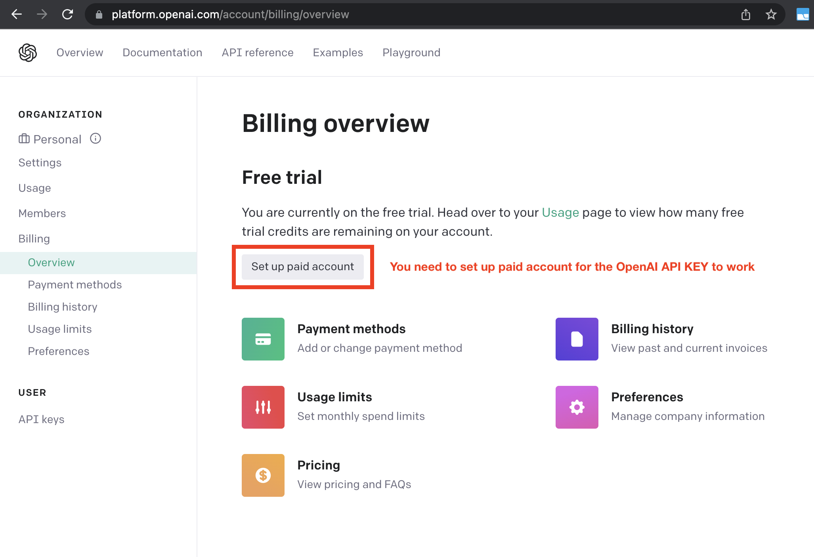

# Setting up Auto-GPT

## 📋 Requirements

Choose an environment to run Auto-GPT in (pick one):

  - [Docker](https://docs.docker.com/get-docker/) (*recommended*)
  - Python 3.10 or later (instructions: [for Windows](https://www.tutorialspoint.com/how-to-install-python-in-windows))
  - [VSCode + devcontainer](https://marketplace.visualstudio.com/items?itemName=ms-vscode-remote.remote-containers)


## 🗝️ Getting an API key

Get your OpenAI API key from: [https://platform.openai.com/account/api-keys](https://platform.openai.com/account/api-keys).

!!! attention
    To use the OpenAI API with Auto-GPT, we strongly recommend **setting up billing**
    (AKA paid account). Free accounts are [limited][openai/api limits] to 3 API calls per
    minute, which can cause the application to crash.

    You can set up a paid account at [Manage account > Billing > Overview](https://platform.openai.com/account/billing/overview).

[openai/api limits]: https://platform.openai.com/docs/guides/rate-limits/overview#:~:text=Free%20trial%20users,RPM%0A40%2C000%20TPM

!!! important
    It's highly recommended that you keep keep track of your API costs on [the Usage page](https://platform.openai.com/account/usage).
    You can also set limits on how much you spend on [the Usage limits page](https://platform.openai.com/account/billing/limits).




## Setting up Auto-GPT

### Set up with Docker

1. Make sure you have Docker installed, see [requirements](#requirements)
2. Pull the latest image from [Docker Hub]

        :::shell
        docker pull significantgravitas/auto-gpt

3. Create a folder for Auto-GPT
4. In the folder, create a file called `docker-compose.yml` with the following contents:

        :::yaml
        version: "3.9"
        services:
          auto-gpt:
            image: significantgravitas/auto-gpt
            depends_on:
              - redis
            env_file:
              - .env
            environment:
              MEMORY_BACKEND: ${MEMORY_BACKEND:-redis}
              REDIS_HOST: ${REDIS_HOST:-redis}
            volumes:
              - ./:/app
            profiles: ["exclude-from-up"]
          redis:
            image: "redis/redis-stack-server:latest"

5. Create the necessary [configuration](#configuration) files. If needed, you can find
    templates in the [repository].
6. Continue to [Run with Docker](#run-with-docker)

!!! note "Docker only supports headless browsing"
    Auto-GPT uses a browser in headless mode by default: `HEADLESS_BROWSER=True`.
    Please do not change this setting in combination with Docker, or Auto-GPT will crash.

[Docker Hub]: https://hub.docker.com/r/significantgravitas/auto-gpt
[repository]: https://github.com/Significant-Gravitas/Auto-GPT


### Set up with Git

!!! important
    Make sure you have [Git](https://git-scm.com/downloads) installed for your OS.

!!! info "Executing commands"
    To execute the given commands, open a CMD, Bash, or Powershell window.  
    On Windows: press ++win+x++ and pick *Terminal*, or ++win+r++ and enter `cmd`

1. Clone the repository

        :::shell
        git clone -b stable https://github.com/Significant-Gravitas/Auto-GPT.git

2. Navigate to the directory where you downloaded the repository

        :::shell
        cd Auto-GPT


### Set up without Git/Docker

!!! warning
    We recommend to use Git or Docker, to make updating easier.

1. Download `Source code (zip)` from the [latest stable release](https://github.com/Significant-Gravitas/Auto-GPT/releases/latest)
2. Extract the zip-file into a folder


### Configuration

1. Find the file named `.env.template` in the main `Auto-GPT` folder. This file may
    be hidden by default in some operating systems due to the dot prefix. To reveal
    hidden files, follow the instructions for your specific operating system:
    [Windows][show hidden files/Windows], [macOS][show hidden files/macOS].
2. Create a copy of `.env.template` and call it `.env`;
    if you're already in a command prompt/terminal window: `cp .env.template .env`.
3. Open the `.env` file in a text editor.
4. Find the line that says `OPENAI_API_KEY=`.
5. After the `=`, enter your unique OpenAI API Key *without any quotes or spaces*.
6. Enter any other API keys or tokens for services you would like to use.

    !!! note
        To activate and adjust a setting, remove the `# ` prefix.

7. Save and close the `.env` file.

!!! info "Using a GPT Azure-instance"
    If you want to use GPT on an Azure instance, set `USE_AZURE` to `True` and
    make an Azure configuration file:

    - Rename `azure.yaml.template` to `azure.yaml` and provide the relevant `azure_api_base`, `azure_api_version` and all the deployment IDs for the relevant models in the `azure_model_map` section:
        - `fast_llm_model_deployment_id`: your gpt-3.5-turbo or gpt-4 deployment ID
        - `smart_llm_model_deployment_id`: your gpt-4 deployment ID
        - `embedding_model_deployment_id`: your text-embedding-ada-002 v2 deployment ID

    Example:

        :::yaml
        # Please specify all of these values as double-quoted strings
        # Replace string in angled brackets (<>) to your own ID
        azure_model_map:
            fast_llm_model_deployment_id: "<my-fast-llm-deployment-id>"
                ...

    Details can be found in the [openai-python docs], and in the [Azure OpenAI docs] for the embedding model.
    If you're on Windows you may need to install an [MSVC library](https://learn.microsoft.com/en-us/cpp/windows/latest-supported-vc-redist?view=msvc-170).

[show hidden files/Windows]: https://support.microsoft.com/en-us/windows/view-hidden-files-and-folders-in-windows-97fbc472-c603-9d90-91d0-1166d1d9f4b5
[show hidden files/macOS]: https://www.pcmag.com/how-to/how-to-access-your-macs-hidden-files
[openai-python docs]: https://github.com/openai/openai-python#microsoft-azure-endpoints
[Azure OpenAI docs]: https://learn.microsoft.com/en-us/azure/cognitive-services/openai/tutorials/embeddings?tabs=command-line


## Running Auto-GPT

### Run with Docker

Easiest is to use `docker-compose`. Run the commands below in your Auto-GPT folder.

1. Build the image. If you have pulled the image from Docker Hub, skip this step.

        :::shell
        docker-compose build auto-gpt

2. Run Auto-GPT

        :::shell
        docker-compose run --rm auto-gpt

    By default, this will also start and attach a Redis memory backend. If you do not
    want this, comment or remove the `depends: - redis` and `redis:` sections from
    `docker-compose.yml`.

    For related settings, see [Memory > Redis setup](./configuration/memory.md#redis-setup).

You can pass extra arguments, e.g. running with `--gpt3only` and `--continuous`:
``` shell
docker-compose run --rm auto-gpt --gpt3only --continuous
```

If you dare, you can also build and run it with "vanilla" docker commands:
``` shell
docker build -t auto-gpt .
docker run -it --env-file=.env -v $PWD:/app auto-gpt
docker run -it --env-file=.env -v $PWD:/app --rm auto-gpt --gpt3only --continuous
```

[docker-compose file]: https://github.com/Significant-Gravitas/Auto-GPT/blob/stable/docker-compose.yml


### Run with Dev Container

1. Install the [Remote - Containers](https://marketplace.visualstudio.com/items?itemName=ms-vscode-remote.remote-containers) extension in VS Code.

2. Open command palette with ++f1++ and type `Dev Containers: Open Folder in Container`.

3. Run `./run.sh`.


### Run without Docker

#### Create a Virtual Environment

Create a virtual environment to run in.

``` shell
python -m venv venvAutoGPT
source venvAutoGPT/bin/activate
pip3 install --upgrade pip
```

Simply run the startup script in your terminal. This will install any necessary Python
packages and launch Auto-GPT.

- On Linux/MacOS:

        :::shell
        ./run.sh

- On Windows:

        :::shell
        .\run.bat

If this gives errors, make sure you have a compatible Python version installed. See also
the [requirements](./installation.md#requirements).
